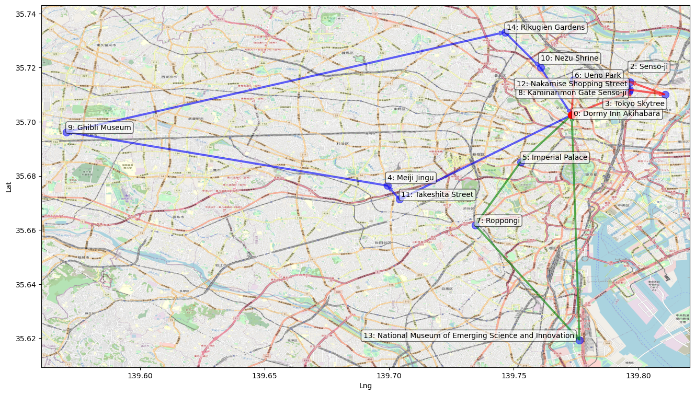

# Camino
Travel Route Recommender and Optimizer

## Purpose

Camino is designed to allow one to easily create a multi-day travel iternerary that is optimized for efficiency.
Given a list of locations and business hours, along with a user profile, the algorithm is able to recommend sights and determine a series of routes that minimizes time spent traveling.

Example: 3 day vacation plan in Tokyo, Japan. User preferences currently factored: time spent at each location, active hours. 

Further updates will incorporate fine-tuned LLM into the application via a front-facing interface to generate user profiles.

## Tech Stack and Libraries
Frontend - Javascript (React), HTML5, CSS

Backend - Python (NumPy, Pandas, Matplotlib, BeautifulSoup, RequestsHTML, SQLalchemy, Google OR Tools, PyTorch, HuggingFace)

Database - PostgreSQL